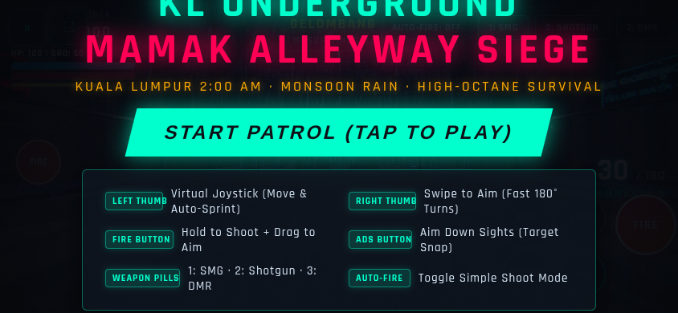
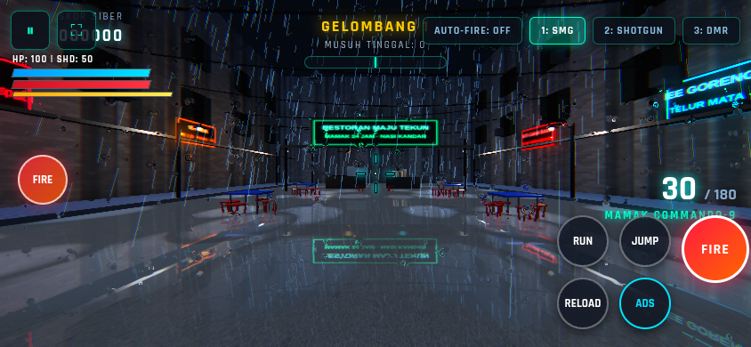
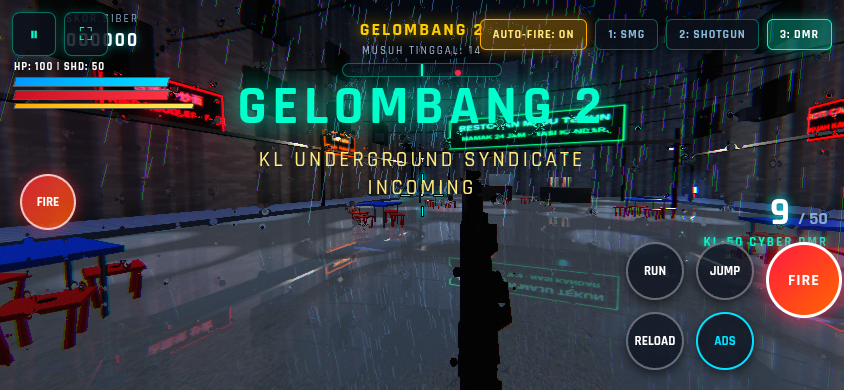
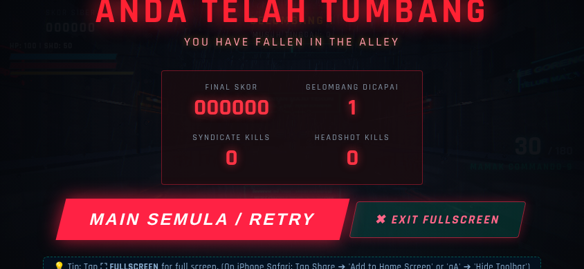

# 🎯 Underground Neon KL: Mamak Alleyway Siege

> **⚠️ Server/tunnel are managed automatically.** A watchdog (Hermes cron, every 5 min)
> keeps the Vite dev server (port 5180) and the public tunnel
> (https://mamakfps.loophole.site) alive. **Do not run `npm run dev` or any tunnel
> command** — edit files instead (Vite hot-reloads instantly). See `GEMINI.md` section 0.


[](https://threejs.org/)
[](https://www.khronos.org/webgl/)
[](https://vitejs.dev/)
[](https://developer.mozilla.org/en-US/docs/Web/JavaScript)
[](LICENSE)

> A high-octane, atmospheric 3D First-Person Horde Survival Shooter running directly in the browser with **Three.js**, **custom WebGL shaders**, and **100% procedural Web Audio synthesis**.

---

## 📸 Screenshots & Gameplay

| Mobile Start & Tactical Briefing | Nocturnal Mamak Alleyway & HUD |
|:---:|:---:|
|  |  |

| High-Octane Wave Combat | Fullscreen & Game Over Telemetry |
|:---:|:---:|
|  |  |

---

## 🌆 Setting: Nocturnal Kuala Lumpur at 2:00 AM

Step into a rain-slicked Malaysian back-alley surrounded by pre-war colonial shophouses, corrugated zinc awnings overhanging the five-foot ways (*kaki lima*), dripping electrical conduits, and a vibrant 24-hour Mamak stall (**Restoran Maju Tekun**):

- **Authentic Multilingual Neon Signage**: Handcrafted glowing neon signs in Malay, Chinese, and Tamil:
  - `"RESTORAN MAJU TEKUN 24 JAM · NASI KANDAR"`
  - `"TEH TARIK RM 2.50 · PANAS / AIS"`
  - `"吉隆坡 炒面 · KL FRIED NOODLES · 印度煎饼"`
  - `"தேநீர் கடை · ரொட்டி · சுடச்சுட"`
  - `"ROTI CANAI BANJIR · KUAH KARI KAW KAW"`
  - `"MEE GORENG BASAH · TELUR MATA · PEDAS"`
- **Stainless Steel Roti Canai Cart**: Hot iron griddle, glass food warmer with incandescent warming lamps, and spinning overhead ceiling fans.
- **Destructible Kinetic Furniture**: Classic red plastic hexagonal Mamak stools (complete with iconic center hole) and folding tables that clatter, flip, and tumble when struck by shotgun blasts or enemy smashes.

---

## 🔫 Core Gunplay & AAA Mechanics

Built with Call of Duty-style responsiveness and tactile game feel:

1. **Mamak Commando-9 (Bullpup SMG/AR)**:
   - 750 RPM rapid fire, 30-round magazine, snappy iron sights, punchy muzzle reports.
2. **Street Sweeper 12G (Pump-Action Combat Shotgun)**:
   - 8 pellets per shell, heavy close-range impulse flinging enemies and furniture backward, procedural slide rack animation, and mechanical `CLACK-CHICK` slide audio.
3. **KL-50 Cyber-DMR (Marksman Rifle)**:
   - 10 rounds, semi-automatic, high stopping power, 2.5x optical zoom with a custom **parallax holographic chevron reticle**.

### Gunplay Systems
- **Dual-Spring Procedural Recoil**: Translational kickback ($Z$), rotational pitch kick ($X$), and random yaw roll ($Y$) with smooth spring-damper recovery.
- **Figure-8 Lissajous Bobbing**: Harmonic camera and weapon movement synchronized with walking and sprinting footstep audio.
- **Tactical Reload Cancellation**: Switch weapons at any time during a reload without freezing weapons.
- **Dynamic Hit Feedback**: Directional 2D hitmarkers (white on hit, crimson skull on headshot), neon wall sparks, concrete puffs, and cyber-blood splatters.

---

## 🔮 Custom WebGL Shaders & Graphics Tech

- **Real-Time Planar Floor Puddle Reflection** (`src/shaders/puddleShader.js`):
  - Dynamic reflection camera rendered to a `WebGLRenderTarget`.
  - Expanding concentric rings with damped cosine profiles simulate raindrops impacting puddles.
  - Multi-octave simplex noise creates screen-space water distortion.
- **Holographic Parallax Red Dot Sight** (`src/shaders/holographicReticle.js`):
  - Optical lens shader projecting a glowing reticle into infinity with view-angle parallax inside the scope tube.
- **Screen-Space Post-Processing** (`src/shaders/postProcessingShaders.js`):
  - Volumetric bloom threshold and dual 9-tap separable Gaussian blur passes.
  - Screen-space monsoon water droplets running down the visor with gravitational drip tails.
  - Anamorphic chromatic aberration, subtle vignette, and cinematic film grain.
- **Dynamic Tropical Weather** (`src/environment/WeatherSystem.js`):
  - 3,500 instanced rain streaks slanted with monsoon wind.
  - Directional moonlight with back and front fill rim-lighting on enemies.
  - Atmospheric lightning flashes synced with delayed reverberant thunderclaps.

---

## 📱 AAA Mobile Touch Experience

Engineered from the ground up for smooth play on smartphones and tablets (iOS Safari, Android Chrome):

- **Dynamic Floating Virtual Joystick**: Anchors dynamically wherever your left thumb touches; pushing $> 82\%$ forward locks auto-sprint.
- **Aim-on-Fire (Drag to Aim while Shooting)**: Holding the fire button shoots while dragging allows one-thumb recoil compensation and enemy tracking.
- **Claw Grip Support**: Dedicated secondary left fire button for 3-finger or 4-finger players.
- **Smart Aim Assist**: Reticle friction slows crosshair when sweeping over enemy hitboxes, subtle target magnetism pulls toward center of mass, and snap-to-target activates on tapping ADS.
- **Toggleable Auto-Fire ("Simple Mode")**: Tap `[ AUTO-FIRE: ON/OFF ]` on the top bar to automatically fire when reticle aligns with enemies.
- **Non-Linear Camera Look**: Micro-swipes for headshot precision; fast flicks accelerate non-linearly to enable easy $180^\circ$ turns.
- **Responsive Mobile HUD**: Vitals moved to top-left; ammo counter elevated above action buttons; desktop keyboard slots hidden.
- **Orientation Advisory**: Screen overlay prompting rotation if opened in portrait mode.

---

## 🖥️ Full Screen & PWA Capabilities

- **Dedicated Fullscreen Buttons**: Available on the Start Menu, Pause Menu, Game Over screen, and In-Game Top Bar (`[ ⛶ FULLSCREEN ]`).
- **Auto-Fullscreen on Tap**: Tapping `START PATROL` or `MAIN SEMULA / RETRY` on mobile automatically requests fullscreen and locks landscape orientation.
- **Desktop**: Click `[ ⛶ FULLSCREEN ]` or press `F11`.
- **Android**: Fullscreen API immediately hides the browser address and navigation bars for 100% borderless gameplay.
- **iOS Safari (iPhone / iPad)**:
  - **Option 1 (Quick)**: Tap the `aA` icon in Safari's address bar and select **"Hide Toolbar"**.
  - **Option 2 (PWA Native App)**: Tap the **Share icon ⎋** and choose **"Add to Home Screen"**. With our included `manifest.json`, the game launches completely borderless like a native app.

---

## 🎮 Controls Cheat Sheet

### Desktop Keyboard & Mouse
| Input | Action |
|---|---|
| `W A S D` | Walk & Strafe |
| `Left Shift` | Tactical Sprint |
| `Spacebar` | Jump / Vault |
| `Mouse Move` | Look / Aim (Pointer Lock) |
| `Left Click` | Fire Weapon |
| `Right Click` | Aim Down Sights (ADS) |
| `R` | Reload Magazine |
| `1 · 2 · 3` | Quick-Switch Weapons (SMG / Shotgun / DMR) |
| `ESC` or `P` | Pause Game |
| `F11` / `⛶` | Toggle Fullscreen |

### Mobile Touchscreen
| Touch Zone / Button | Action |
|---|---|
| **Left Screen Zone** | Floating Virtual Joystick (Move & Strafe) |
| **Push Stick > 82%** | Auto-Sprint Lock |
| **Right Screen Zone** | Swipe to Aim (Velocity-Accelerated) |
| **Primary Fire (Right)** | Hold to Shoot + Drag to Aim |
| **Secondary Fire (Left)** | Claw Grip Fire Trigger |
| **ADS Button** | Toggle Aim Down Sights (Target Snap) |
| **Top-Bar Weapon Pills** | Quick-Switch `1: SMG`, `2: SHOTGUN`, `3: DMR` |
| **Auto-Fire Pill** | Toggle Simple Auto-Fire Mode |
| **Pause `⏸`** | Pause Mission & Open Menu |
| **Fullscreen `⛶`** | Toggle Full Screen |

---

## ⚡ Getting Started

### Prerequisites
- Node.js (v18 or higher recommended)
- npm or pnpm / yarn

### Installation & Run
```bash
# 1. Clone the repository
git clone https://github.com/engkufizz/KL_Mamak_FPS.git
cd KL_Mamak_FPS

# 2. Install dependencies
npm install

# 3. Start local development server (starts on port 5180)
npm run dev

# 4. Open in browser
# Navigate to http://localhost:5180
```

### Production Build
```bash
# Compile minified production bundle to dist/
npm run build

# Preview the production build locally
npm run preview
```

---

## 🤖 AI-Assisted Development & Architecture Guide

If you are using an AI coding assistant (Google Gemini, Claude, Antigravity, Cursor, etc.) to extend, debug, or improve this game, please refer to:

👉 **[GEMINI.md](GEMINI.md)** — Contains complete architecture blueprints, game system mechanics, procedural synthesis rules, performance budgets, and conventions.

---

## 📜 License

This project is licensed under the MIT License. See [LICENSE](LICENSE) for details.
